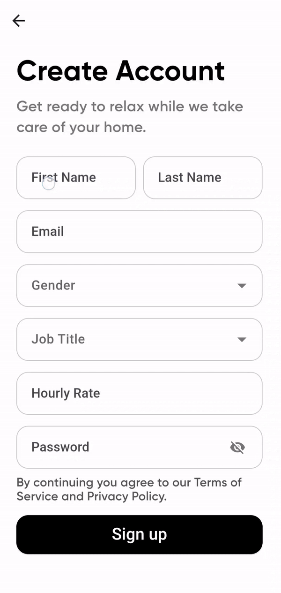
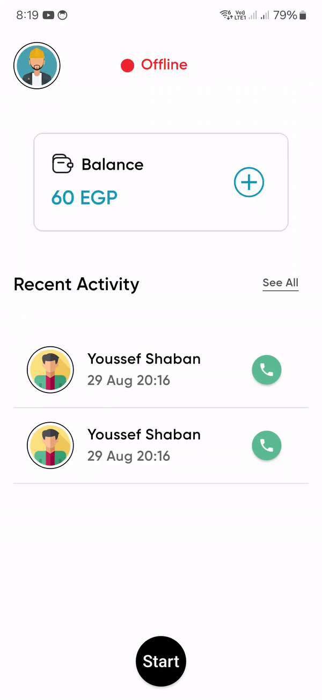
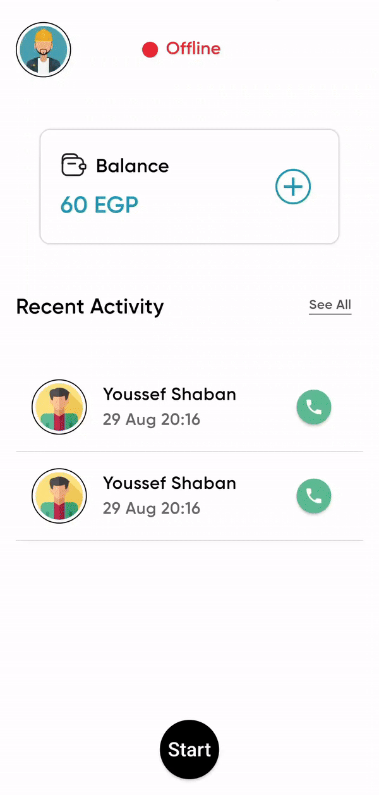

<section id="fannelance-app" align="center">
  
  <h1>Fannelance Worker App</h1>
</section>

## Overview

A platform where skilled technicians can showcase their skills and connect with the nearest customers in their area to meet their needs.

## Running App

<section id="screens">
  
  
  
  
  
</section>

## Features

- **Phone Number Verification**: Securely verify your phone number using a one-time password (OTP) before creating your account.
- **Nearby Customers Find You**: Based on your current location you appear to nearby customers.
- **Customer Preview**: View detailed preview of customer.
- **Request Service**: The ability to accept or reject the customer's request.

## Upcomming Features

- **In-App Communication**: Chat with customers directly within the app to discuss details and updates.
- **Secure Payments**: Make secure payments directly through the app once the job is completed.

## Getting Started

### Prerequistes

- Ensure you have [Flutter]("https://docs.flutter.dev/get-started/install") installed on your device.
- A compatible Android device or emulator to run the app.

### Installation

1. Clone the repository:

```bash
  git clone https://github.com/Fannelance/User-Flutter-App.git
  cd User-Flutter-App
```

2. Install dependencies

```bash
  flutter pub get
```

3. Set up environment variables. Create a .env file in the root directory and add the following:

```bash
  secretKey = your_stripe_secret_key;
  publishableKey = your_stripe_public_key;
  serverURL = 'http://your_server_ip_address:3000';
```

4. Run the app on your perferred device:

```bash
  flutter run
```

## Usage

1. **Sign Up or Log In**: Create a new account or log in with your existing credentials.
2. **Set Your Location**: Allow the app to access your location to find nearby customers.
3. **Update Availability**: Update your availability in realtime.
4. **Request Service**: You can accept or reject the customer's request.
